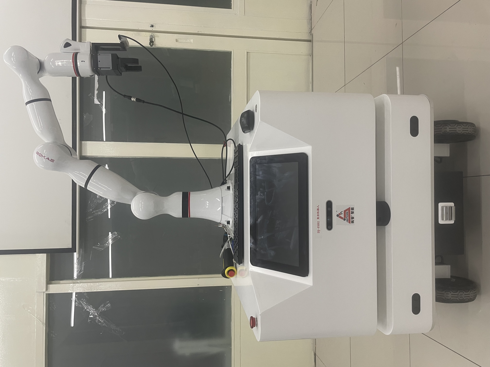
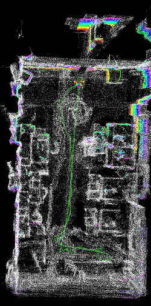

# Hybrid Robot Demo

  This repository mainly contains the driver and algorithm codes for the hybrid robot project, which provides BUU (Beijing Union University) Robot College. The hybrid robot is consist of the moving plaform (Sage Co., Ltd) and 7 Dof robot arm (ROKAE Co., Ltd). 

## Goal

* Autonomy Mapping and Navigation with Avoiding Obstacles
* Object Recognition and Graspping

## Dependencies

### Hardware

* Moving Platform and Robot Arm
* Camera and Gripper

### Software

* **SLAM:** `gmapping (*2d Laser Mapping*), move_base (*Navigation Framework*), rrt_exploration (*Global Navigation Planner*), DWA (*Local Navigation Planner*), A-LOM (*3d Laser Mapping*), TF (*coordinate transform*)
* **Robot Control:** ros_control (*control interface*), KDL (kinematics & dynamics library), TF (coordinate transform), Modbus & 485 (*gripper communication protocol*)
* **Computer Vision:** librealsense (*realsense2 camera driver*), TF (*coordinate transform*), aruco (*object recognition*), calibration

## Instruction

* car_control

  In this folder, the codes are mainly for the car driver and SLAM. It contains six folders: *A-LOAM* is mainly for the 3d laser algorithm, *dwa_planner* is the avoiding algorithms, exactly local planner for the move base, *rrt_exploration* is the RRT algorithm realization, exactly global planner for the SLAM, *lslidar_c16* is the drvier of the 3d laser, *ydlidar_ros* is the driver of the 2d laser. Finally, *four_wheels* is the car driver and control. It contains all of the `launch` file, which can be used in this project.

* robot_control

  In this folder, the codes are mainly for controlling the robot arm in cartesian coordinate. I have create customized message - *cartesian_state_msgs*. In *move_control* folder, it contains the gripper node and move control node, which is controlling the robot in cartesian coordinate. And it also is implemented all of the driver and executable file in `launch` file.

* Computer_vision

  In this folder, the codes are mainly for the camera (Intel Realsense2 D435) driver and aruco_ros. The realsense2 camera can be used in ros, which thanks to Intel Co., Ltd. In the camera file, it can register the node in the ros master and transform the captured image.

## Epitome

